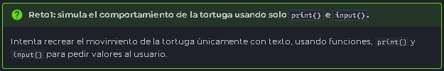
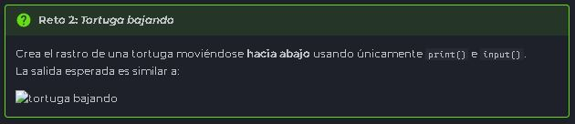
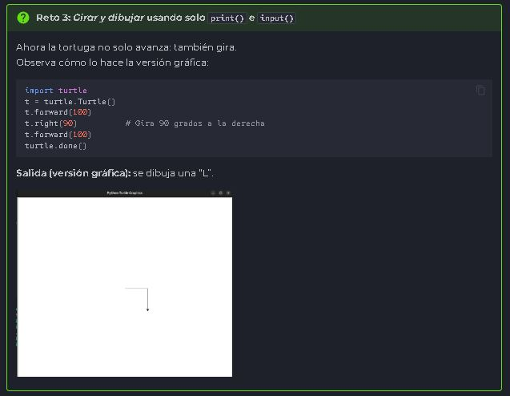
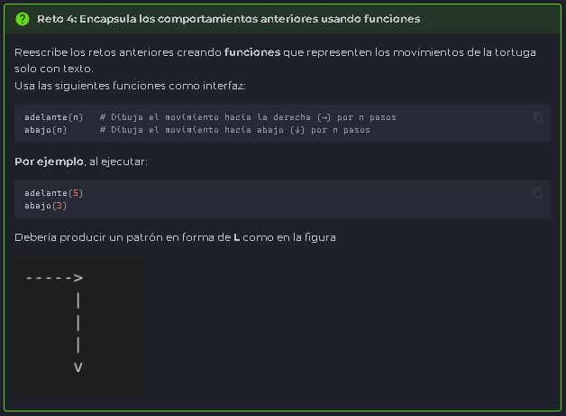
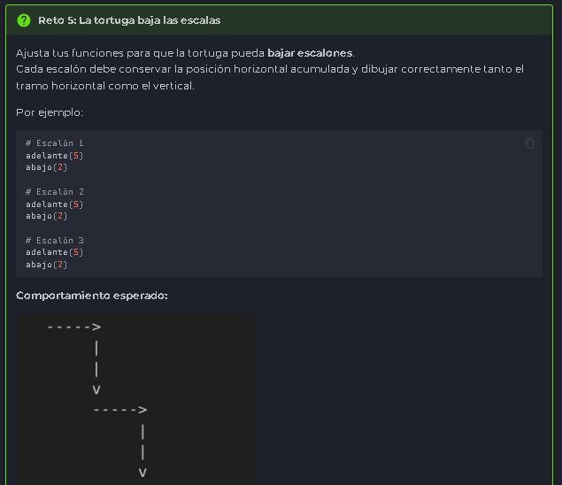

<h1 align="center">
    RETO NRO. 1
</h1>



Mi solucion fue un poco dura ya que decidi añadir la imagen de la tortuga, la cual casi no la consigo. Ademas cometi tantos errores que no me queria correr correctamente el programa.
Hasta que le pregunte a la IA "GEMINI" y me recomendo resetear el kernel, despues de hacerlo el programa corrio correctaente.

````
Python

tortuga = "🐢"
pasos_adelante= int (input("Ingrese el número de pasos hacia adelante: "))
print ("_ " * (pasos_adelante - 1) + tortuga)

````
<br>
<h1 align="center">
    RETO NRO. 2
</h1>



Este reto no estuvo demasiado dificil, ya que me base en el anterior, lo unico que debi buscar fue como hacer el salto de linea sin tener que repetir varias veces la funcion "Print".

````
Python

tortuga = "🐢"
pasos_abajo= int (input("Ingrese el número de pasos hacia abajo: "))
print (" \n| " * (pasos_abajo) + tortuga)

````
<br>
<h1 align="center">
    RETO NRO. 3
</h1>



Este reto se me complico mucho ya que no era capaz de alinear el camino horizontal con el vertical. Logre hacerlo, gracias a que copie el codigo que hice en GEMINI para saber que era el error. Logre encontrarlo con esta ayuda y lo pude solucionar.

````
Python

tortuga = "🐢"
pasos_adelante= int (input("Ingrese el número de pasos hacia adelante: "))
print ("_ " * pasos_adelante)
espacios = "  " * pasos_adelante 
camino_abajo = espacios + "|\n"
pasos_abajo= int (input("Ingrese el número de pasos hacia abajo: "))
print(camino_abajo * (pasos_abajo - 1), end='')
print(espacios + tortuga)

````
<br>
<h1 align="center">
    RETO NRO. 4
</h1>



En este reto me fue mal, casi no logro dar con la solucion, aunque no lo pude ensayar; ya que en VSC no me corre el programa y por la terminal me dice que el directorio no existe. Debido a esto le pregunte a GEMINI que si el codigo estaba correcto, a lo cual me respondio que "SI".

````
Python

tortuga = "🐢"
espacios = "0"

def adelante(pasos_adelante):
    print ("_ " * pasos_adelante)
    global espacios, camino_abajo
    espacios = " " * pasos_adelante
    camino_abajo = espacios + "    |\n"
    
def abajo(pasos_abajo):
    global espacios, camino_abajo
    print(camino_abajo * (pasos_abajo - 1),  end='')
    print(espacios + "    " + tortuga)
    

adelante(5)
abajo(3)

````
<br>
<h1 align="center">
    RETO NRO. 5
</h1>



Este reto logre resolverlo gracias a la guia del profesor, aunque luche un poco para lograrlo. A lo ultimo logre hacerlo y ponerlo esteticamente mejor.


````
Python

#SOLUCION RETO NRO 5

tortuga = "🐢"
espacios = 0

def adelante(pasos_adelante):
    
    global espacios
    print (espacios * "  " + " _" * pasos_adelante)
    espacios = espacios + pasos_adelante
    
    
def abajo(pasos_abajo):
    
    for i in range(pasos_abajo - 1):
        camino_abajo = "  " * espacios + "|\n"
        print(camino_abajo, end='')
    print("  " * espacios + tortuga)


adelante(5)
abajo(3)

adelante(5)
abajo(3)

adelante(5)
abajo(3)

````


