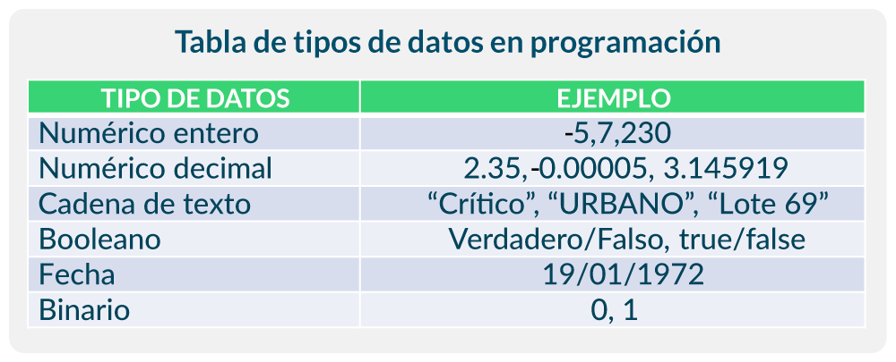
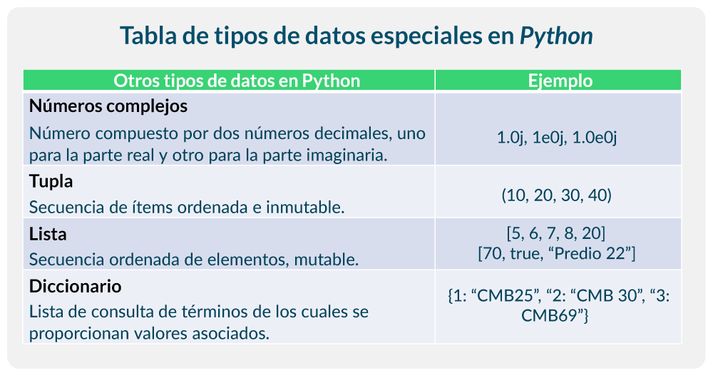
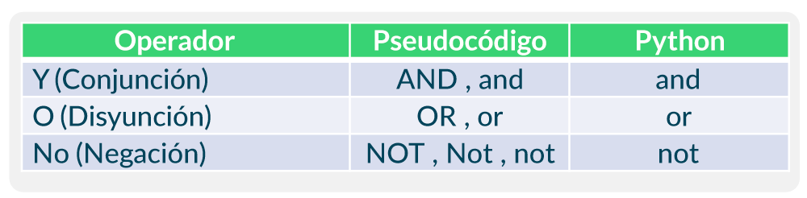

# Kevin9115.github.io
Mi Primera Pagina
PENSAMIENTO ALGORITMICO

Durante las primeras clases que hemos tenido hasta el momento, primeramente el profesor Juan Camilo nos dio una breve introduccion a lo que es este gran mundo de la programacion. empezando hablar sobre como fueron los inicios de las computadoras; dandonos como ejemplo "El Abaco" que si lo llegaramos a pensar bien, fue el principio de lo que actual conocemos como computador.

Tambien vimos conceptos como los siguientes:

****LENGUAJE DE PROGRAMACION:*** es un lenguaje formal que le proporciona a un programador, la capacidad de escribir (o programar) una serie de instrucciones o secuencias de órdenes en forma de algoritmos, con el fin de controlar el comportamiento físico o lógico de una computadora, de manera que se puedan obtener diversas clases de datos o ejecutar determinadas tareas.

**Algunos tipos de lenguaje son:**

**Como son usados por la máquina o sistema operativo:

Interpretados: las instrucciones son traducidas una a una por una aplicación (intérprete). Ejemplos: Python, Perl, Bash.

Compilados: las instrucciones son traducidas en grupo por una aplicación (compilador). Ejemplos: Fortran, C/C++.

Intermedios: en parte compilados, en parte interpretados. Ejemplos: Java, Scala.

**De acuerdo a su nivel de abstracción:

Alto nivel: la información compleja es representada con objetos simples. Ejemplos: Python, C++, C#, Java.

Bajo nivel: la información compleja debe representarse literalmente. Ejemplos: Assembly y Machine.

***ENTORNO DE DESARROLLO:*** también conocidos como IDE, Integrated Development Environment, son editores de código diseñados para que los desarrolladores puedan escribir el código. Una IDE muy usada academicamente es Google Colaboratory o Colab. esta es muy practica y facil de usar.

****PROGRAMA:*** es un conjunto de instrucciones ordenadas y escritas en un lenguaje que una computadora puede interpretar y ejecutar para realizar una tarea o función específica. Todo esto dirigido a resolver un problema o suplir alguna necesidad.

****ALGORITMO:*** es un conjunto de instrucciones o reglas detalladas, ordenadas que al seguirse permiten resolver un problema específico o realizar una tarea determinada. Este esta compuesto por 3 elementos basicos "Entradas, Procesos y Salidas".
Las __ENTRADAS__ se refieren a los insumos requeridos para dar solución al problema y se pueden presentar de multiples formas (numeros, nombres, fechas, entre otros). Los __PROCESOS__, conforman las acciones que se encargan de procesar los datos de entrada con el propósito de devolver los resultados esperados. Las __SALIDAS__ son las diferentes formas en que se presentan los resultados del procesamiento de los datos que entraron al algoritmo. Es decir, corresponden a la solución del problema.

Si situaramos al programador y al cliente entre los elemntos del algoritmo; el programador se situaria en las entradas (es el unico que comprende el algoritmo) y el cliente en las salidas (solo le ineteresa el resultado).

el algoritmo debe cumplir con 3 condiciones: debe resolver un problema, debe ser finito y debe interactuar con datos externos y/o variables.

****VARIABLES:*** son los espacios en memoria en los cuales se almacenan, de manera temporal, los datos que serán utilizados en el procesamiento para la obtención del resultado esperado en el algoritmo.

****CONSTANTES:*** son valores que resultan invariables no solo en el contexto de la ejecución del algoritmo, sino también por fuera e independiente del mismo.

***TIPOS DE ACCIONES O INSTRUCCIONES DE PROCESAMIENTO:***

__Instrucciones Lógicas:__ Se utilizan únicamente para operar datos de tipo lógico o booleano (verdadero o falso). Las expresiones lógicas dan como resultado otro dato de tipo lógico.

__Instrucciones Matemáticas:__ Se aplican sobre datos de tipo numérico y permiten realizar las operaciones aritméticas o matemáticas.

***OPERADORES:***

<h3 align="center">ARITMETICOS</h3>

<h3 align="center">RELACIONALES</h3>

<h3 align="center">LOGICOS</h3>

***EJEMPLO DE CODIGO EN PYTHON:***

nombre = input("Por Favor, Ingresa Tu Nombre: ")

print(f"¡Hola , {nombre}! Bienvenido. ")

print("¡Diste El Primer Paso!")

***REFLEXION:***

Para mi en lo que llevo del curso me ha dado a conocer y entender un poco de todo lo que conlleva hacer una computadora, una app, un programa. Cualquier software que estemos utilizando es un mundo gigante; y que para ello tuvieron que intervenir muchas personas, trabajar en equipo y cumplir con unos requsistos especificos. Es un sector en el cual siempre se aprende, ya que a diario vemos como la civilizacion avanza y son mas los requerimientos que se presentan, entonces es una profesion en la cual nunca se deja de aprender, es una profesion que llegado al caso se decide por tomar, se debe de hacer de corazon. 
Espero aprender mucho durante este tiempo de estudio, es algo que siempre habia querido conocer y estudiar, pero que por malas decisiones no lo habia hecho. Pero nunca es tarde para aprender y aca vamos paso a paso. Muchas gracias.

***Referencias:***

+Material academico en la plataforma de la IU Digital.

+Gemini: Google. (2025, 9 de noviembre). Cómo subir una imagen a mi repositorio en GitHub [Modelo de lenguaje grande]. https://gemini.google.com/.

+Gemini: Google. (2025, 9 de noviembre). Cómo centrar un título en GitHub [Modelo de lenguaje grande]. https://gemini.google.com/.
